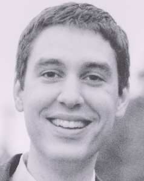

I'm a computer engineer and maker located in Seattle, WA. I started 'making' at six years old, building bird houses with my father. My love of making quickly turned toward electronics, software, and automation which lead me to attend the University of Minnesota where I earned a bachelor's degree in Computer Engineering and worked as a research assistant at the Center for Distributed Robotics. After graduating I joined National Instruments as part of the Engineering Leadership Program and spent time as a LabVIEW Embedded product support engineer, and a systems engineer in the academic group. I'm currently an engineering manager at Digilent. I'm also the founder of LabVIEW MakerHub.

I'm always interested to hear about opportunities to collaborate: <a href="mailto:samkristoff.com@gmail.com" target="_top">samkristoff.com@gmail.com</a>

